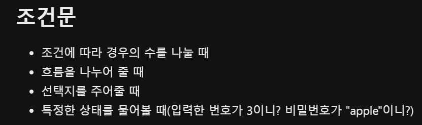

# Backend_Study
백엔드 공부한거 공유하는 레포지토리입니다. <br/>
각자 공부한거 공유해주세요!


JAVA

day01

자바란?
- 컴파일 언어
- 객체 지향 언어

JVM(자바 가상 머신)
- 자바로 만들어진 프로그램을 실행하는 'os'
- 플랫폼 독자적인 실행 환경을 제공
- 자동 메모리 관리(GC)를 수행

JRE(자바 런터암 환경)
- JVM을 실행하기 위한 자바 실행 환경
- 자바 실행에 필요한 장비들을 가지고 있다.

JDK(자바 개발 킷)
- 자바 프로그램을 만들기 위한 개발자용 개발 도구
- 자바 개발에 필요한 라이브러리을 가지고 있다.

↑ 위 3개는 JAVA가 돌아가는데 필요한 환경

컴파일
사람 언어를 컴퓨터 언어로 번역

컴파일러
자바는 JAVAC로 컴파일한다.

-----------------------------------

day02

자바의 프로그램 구조
프로젝트 > package > class > method > code

중괄호는 자바스크립트와 같다.
→ 영역, 바디 : 클래스 영역, 메소드  영역을 나타낸다.

출력메소드
자바스크립트에서는 console.log라면
자바에서는 print, println, printf가 있다.

print
- 괄호안의 값을 출력해는준 기능
- 줄바꿈 x

    ex) System.out.print("a");

println
print와 동일하지만 마지막에 줄바꿈을 한다.

* 출력을 하려고 하면 자바에서는 'main' 메소드는 필수이다.

값을 쓸 때 주의할점
자바스크립트와 다르게 'a', "a"는 차이가 있다.
자바에서는 ''는 한글자 문자에만 쓰고 ""는 문자열에만 쓴다.

    'a' : 문자
    "a" : 한글자지만 문자열로 인식

변수
- 하나의 데이터 값을 저장할 수 있는 저장 공간
- 프로그램에 의해서 수시로 값이 변동된다.

변수 선언
변수 타입과 변수명 결정
변수타입 변수명;

    ex)
    String name;
    int age;
    float/double avg;
    char a;

변수 초기화
변수에 값을 저장
age = 23;

변수 사용
System.out.println(age);

변수의 종류
원시타입, 참조타입

    - 원시타입
        변수의 기본형으로 모든 프로그램에서 공통적인 타입

    - 참조타입
        Object 객체를 참조하여 상속
        String, Array, List 등 클래스 자료형

변수 선언시 주의사항
같은 이름의 변수를 여러개 선언 할 수 없다.
초기화를 해준다.
되도록 선언부(메소드 상단부)에 한꺼번에 해준다.

변수명 주의사항
숫자는 맨 앞에 사용할 수 없다.
예약어는 쓸 수 없다.
공백을 사용할 수 없다.
특수문자를 사용할 수 없다.
_(언더바)는 사용 가능
카멜 표기법 : myCar
되도록 한글은 사용하지 않는다.
뜻이 있는 명사형 단어를 사용한다.

변수명 사용 이유
반복되는 같은 의미 값을 쉽게 관리하기 위해서
값에 의미를 부여하기 위해서

------------------------------------------

day03

printf
- 출력형식(Format)을 지정할 수 있는 출력 메소드
- printf는 출력문에서 %를 만나면 해당 순서의 인자를 찾는다.
→ System.out.printf(%d", 10); → 10은 %d의 인자
→ System.out.printf("%d %d", 10, 1); → 10은 첫번째 %d의 인자, 1은 두 번째 %d의 인자

형식 지정자
%d : 정수형(Integer)으로 출력
→ System.out.printf("%d", 100);
%f : 실수형(Float)으로 출력(실수형 기본은 Double)
→ System.out.printf("%f", 10.123);
%c : 문자형(Character)으로 출력
→ System.out.printf("%c", 'a');
%s : 문자열(String)으로 출력
→ System.out.printf("%s", "안녕하세요");

Scanner
입력메소드를 이용하려면 Scanner 클래스를 사용해야 한다.
이 Scanner 클래스를 사용하려면 Scanner을 import해야 한다.

     ● next()
        - 메소드 사용부분 통째로 사용자가 입력한 문자열 값
        - 공백 또는 엔터를 구분점으로 판단하고 분리하여 입력받는다.
            → 김 민주 : "김 민주" 이렇게 출력이 되는 것이 아니라 공백때문에 "김"만 출력이 된다.

     ● nextLine()
        - 메소드 사용부분 통째로 사용자가 입력한 문자열 값
        - 공백도 문자로 입력받는다.
        - 단점이 있는데 엔터를 가져오기 때문에 공백이 출력이 된다.
            → 앞에 nextLine이 아닌 다른 입력이 있다면 의미없는 nextLine()을 하나 미리 사용해야 한다.

형변환
강제적 형변환
(자료형): 형변환 연산자
(자료형)값

        (double)10 → 10.0
        (float)10 → 10.0f
        (char)65 → 'A'
        (int)'A' → 65

        'A'에서 65로 바뀌는것은 아스키코드

        문자를 정수 : Integer.parseInt("10");
        문자를 실수 : Double.parseDouble("10.1");
        정수를 문자 : Integer.toString(4);
        실수를 문자 : Double.toString(10.1);

---
# 삼항 연산자
(조건식) ? (`참일 때 오는 부분`) : (`거짓일 때 오는 부분`) <br/>
조건식 ? 참일때의 값 : 거짓일때의 값 <br />
삼항 연산자는 사용부분 통째로 값 <br />
경우의 수가 두 가지일 때 사용하는것이 좋다.


``` java
import java.util.Scanner;
>
public class OperTest {
>
	public static void main(String[] args) {
		Scanner sc = new Scanner(System.in);
>		
		// 입력
		System.out.print("정수를 입력하세요 : ");
		int num = sc.nextInt();
>		
		// 처리
		String result = num > 0 ? "양수입니다." : (num < 0 ? "음수입니다." : "0입니다.");
>		
		// 출력
		System.out.println(result);
		}
	}
}
```
# 제어문
위에서 아래로만 흐르던 코드의 흐름을 제어하기 위해 사용하는 문장

- 조건문(선택제어문) <br />
  if ~ else if ~ else
  switch ~ case ~ default

- 반복문(반복제어문) <br />
  while
  for



```java
import java.util.Scanner;

public class Quiz {

	public static void main(String[] args) {
		Scanner sc = new Scanner(System.in);
		
		System.out.println("1. C언어");
		System.out.println("2. 파이썬");
		System.out.println("3. 망둥어");
		System.out.println("4. 자바");
		System.out.print("다음중 프로그래밍 언어가 아닌것은 ?");
		int num = sc.nextInt();
		
		
		if(num == 3) {
			System.out.println("정답입니다!");
		} else if(num == 1 || num == 2 || num == 4) {
			System.out.println("오답입니다.");
		} else {
			System.out.println("잘못입력했습니다.");
		}
```


```java
	switch(변수){
	case 값1:
		변수에 담긴 값이 값1 일 때 실행
		break;
	case 값2:
		변수에 담긴 값이 값2 일 때 실행
		break;
	...
	default:
		변수에 담긴 값이 위의 값들이 아닐 때 실행
	}
```


<br />

# for문

반복문 기본원리
1. for 반복문을 만나면 초기식으로 초기값을 설정한다.
2. 조건식을 확인하고 참이면 {} 중괄호 안의 내용을 수행
3. } 닫는 중괄호를 만나면 증감식으로 이동한다.
4. 조건식을 다시 확인하고 참이면 반복, 거짓이면 for문을 종료한다.

```java
import java.util.Scanner;

public class Exam02 {

	public static void main(String[] args) {
		int sum = 0;
		for(int i = 0; i < 10; i ++) {
			sum = sum + i;
			System.out.println("중간결과 :" + sum);
		}
		System.out.println("최종결과 :" + sum);
       // 출력 : 55
       } 
     }
```

---

# 배열
같은 자료형의 여러 변수를 나열해 놓은 것

1. 여러 값들을 하나의 이름과 인덱스로 관리하기 위해서
2. 규칙성이 없던 값들에 규칙성을 부여하기 위해서

## 배열의 선언
```	
    자료형[] 배열명 = {값1, 값2, ....};
	자료형[] 배열명 = new 자료형[칸수];
```
여기서, new 라는 키워드는 "메모리에 새로운 저장공간을 만들어줘" 라는 지시어 이다. 정확히는 "`힙 메모리`에 새로운 저장공간을 int 타입으로 길이만큼 만들어 주세요" 라는 의미.

## 배열의 인덱스 번호
실제 값들이 저장되어 있는 공간이 할당되면 이름은 존재하지 않고 `주소값`만 존재한다. <br/>
따라서 시작 주소값을 배열명 변수가 갖고 있고 주소연산을 통해 다음 주소값으로 이동한다. <br/>
시작 주소에서 이동만 횟수(연산된 정수가)가 인덱스 번호가 되고 첫번째 방은 배열명이 기억하고 있는 주소에서 0번 옮겨야 하므로 인덱스 번호는 `0번`부터 시작된다.


## 배열의 사용
```	
    data = 10;
	println(data);

	배열명[idx] = 값;		// 공간
	println(배열명[idx]);		// 값
```

배열의 길이
- 배열명.length;
```java
	import java.util.Arrays;

public class ArTest {

	public static void main(String[] args) {
		
		int[] array = {5, 10, 100, 99, 17134};
		
//		실제 값들이 저장되는 공간은 현재 비어있는 상태(0으로 초기화 되어있는 상태)
		int[] array2 = new int[5];
		// 첫번째에 1을 대입
		array2[0] = 1;
		
		
		System.out.println(array); 							// 주소값이 출력됨. 출력 :  [I@7dc5e7b4
		System.out.println(array[0]);
		System.out.println(array[1]);
		System.out.println(array[2]);
		System.out.println(array[3]);
		System.out.println(array[4]);
		System.out.println(Arrays.toString(array));			// array이에 담긴 값 출력 : [5, 10, 100, 99, 17134]
		
		
		for(int i = 0; i < 5; i++) {
			System.out.println(array[i]);
		}
		
		for (int i = 0; i < array2.length; i++) {
			System.out.println(array2[i]);
		}	
	}

}
```
---
# 2차원 배열

● 1차원 배열에 단지 대괄호[] 하나만 더 붙인 상태이다. <br>
● 1차원 배열에 * N개의 배열을 만들어 사용한다.

## 배열의 생성

```java
	int[][] score = {
				{100, 100, 100},
				{20, 20, 20},
				{30, 30, 30},
				{40, 40, 40},
				{50, 50, 50},
		};
		// 과목별 총점
		int korTotal = 0, engTotal = 0, mathTotal = 0;
		
		System.out.println("번호 국어 영어 수학 총점 평군");
		System.out.println("=========================");
		
		for (int i = 0; i < score.length; i++) {
			int sum = 0;		// 개인별 총점
			float avg = 0f;		// 개인별 평균
			
			korTotal += score[i][0];
			engTotal += score[i][1];
			mathTotal += score[i][2];
			System.out.printf("%3d", i+1);
			
			for (int j = 0; j < score[i].length; j++) {
				sum += score[i][j];
				System.out.printf("%5d", score[i][j]);
			}
			avg = sum / (float)score[i].length;
			System.out.printf("%5d %5.1f%n", sum, avg);
		}
		System.out.println("================================");
		System.out.printf("총점:%3d %4d %4d%n", korTotal, engTotal, mathTotal);
```


